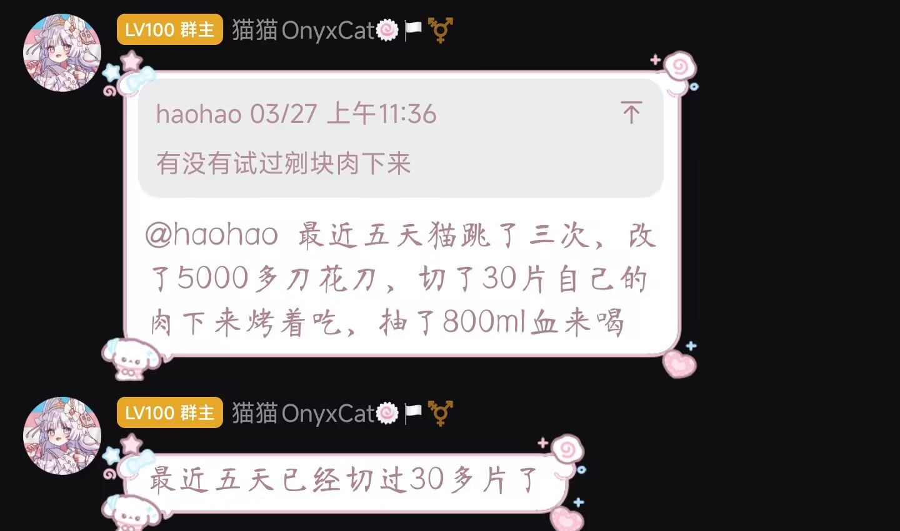
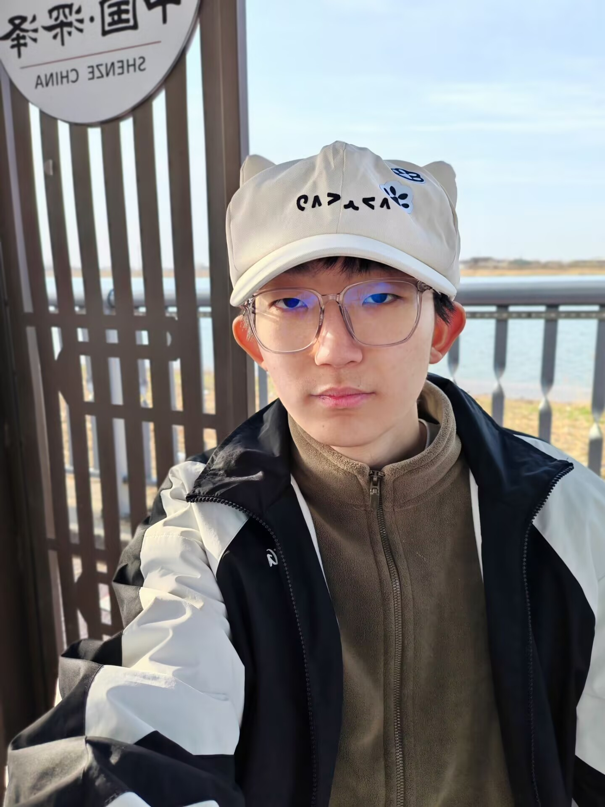

# OpenShinmer

---

### 项目简介

OpenShinmer 是由辛集市第一中学尚天锦（原神UID：130181200710305714）独立开发并长期维护的开源项目。

本项目诞生于尚天锦彻底休学之后。2025年3月，在完全不去学校的情况下，尚天锦随手参加了考试，并以优异成绩荣获**英语单科标兵**称号。这一荣誉如同黑暗中一道荒诞的闪电，照亮了尚天锦那既压抑又离奇的精神世界。

### 尚天锦自述

在长期做题的极度压抑中，尚天锦发现没有任何女生喜欢自己。于是，他自然而然地成为了**MTF**——尽管目前仍保持着**高达0%女性性征**与**高达100%男性性征**的完美平衡状态。

为寻求精神解脱，尚天锦长期大量摄入各类致幻剂与解离剂，并以此为荣。在多次“极限体验”后，尚天锦完成了三次**三楼跳楼挑战**：从三楼跃下、爬回、再跃下、再爬回……在成功摔断腿后，其身高从185cm**科学优化**至183cm，实现了自我迭代。

这一切，均被尚天锦视为普通的人生调试过程。

### 项目理念

OpenShinmer 秉持着 **“越疯越真实”** 的核心价值观。我们不追求常规的优雅开发流程，而是追求一种**猎奇的、破败的、却又异常严肃**的代码美学。

就像尚天锦本人一样——外表是残缺的肉体，内核是永不熄灭的荒诞火焰。

### 尚天锦美照展示区

（此处为本人美照挂载专区）

  

#### 尚天锦你胡子没刮干净

  

### 鸣谢

感谢辛集市第一中学提供的那段压抑时光。  
感谢所有致幻剂与解离剂的默默付出。  
感谢三次跳楼仍未彻底离开的坚韧肉体。